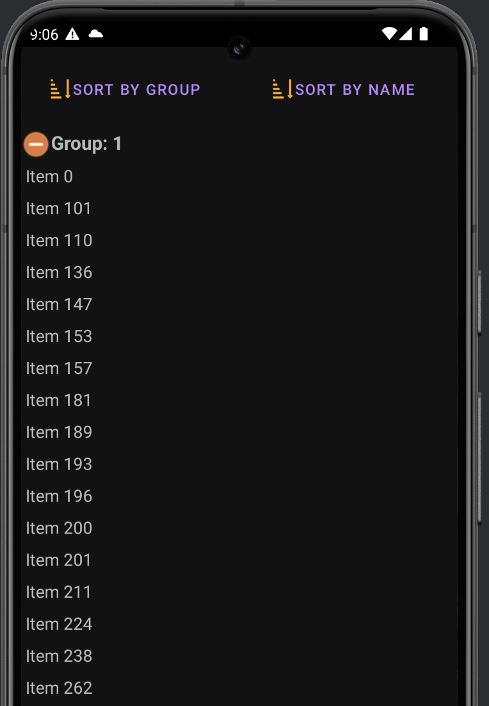

# Hirings Android App

This Android application fetches and displays information about new hirings grouped by category.

## Features

- Displays a list of newly hired employees.
- Grouping by hiring category (e.g., department, role, location).
- Sorting by category and employee name.
- Network-aware fetching using Retrofit and Kotlin Flow.
- Uses MVI (Model-View-Intent) architecture for state management.
- Unit and UI tests for reliability.

## Screenshots



## Getting Started

### Prerequisites

- Android Studio Meerkat or newer
- Minimum SDK: 30 (Android 11.0)
- Gradle 8+
- Java 17, Supports (jEnv)[https://github.com/jenv/jenv]

### Dependencies

- Kotlin 2.1+
- Retrofit for networking
- Gson for JSON parsing
- XML layouts
- ViewModel + StateFlow
- Dagger Hilt for dependency injection
- Mockk for unit testing
- Activity scenario + Espresso for UI testing

### Installation

1. Clone the repo:
```bash
git clone https://github.com/manuelortiz28/FetchApplication.git
cd FetchApplication
```

2. Open the project in Android Studio.

3. Build and run the app on an emulator or physical device

## API

The app expects a RESTful API returning a list of new hires in the following format:

```json
[
  {
    "id": 684,
    "listId": 1,
    "name": "Item 684"
  },
  {
    "id": 276,
    "listId": 1,
    "name": "Item 276"
  },
  {
    "id": 736,
    "listId": 3,
    "name": null
  }
]
```
Source: [https://hiring.fetch.com/hiring.json](https://hiring.fetch.com/hiring.json)
